# 📊 CLASS DIAGRAM SISTEM INFORMASI PERSEDIAAN DELLA FROZEN MART

Dokumen ini menjelaskan struktur kelas, tipe data atribut, metode, serta hubungan antar-kelas (class diagram) yang diimplementasikan pada **Sistem Informasi Persediaan Della Frozen Mart**.

Sistem ini dirancang menggunakan arsitektur **MVC (Model-View-Controller)** yang diperluas dengan **Service Layer** guna memisahkan logika bisnis kompleks seperti perhitungan **FIFO/FEFO** dan **Safety Stock / Reorder Point (ROP)**.

---

## 🗺️ 1. PETA ARSITEKTUR KELAS
Sistem ini terbagi menjadi dua lapisan utama kelas logika:
1.  **Data Layer (Eloquent Models)**: Merepresentasikan entitas database, mendefinisikan struktur kolom/properti, tipe data cast, serta relasi relasional database.
2.  **Logic Layer (Services)**: Menyimpan algoritma utama sistem yang dipiskan dari Controller agar reusable dan mudah diuji.

---

## 🗂️ 2. DIAGRAM KELAS DATABASE (MODELS)

Diagram di bawah menunjukkan seluruh model Eloquent dan bagaimana mereka terhubung satu sama lain di dalam database.

```mermaid
classDiagram
    %% Core Entities
    class User {
        +int id
        +string name
        +string email
        +string password
        +string role
        +bool status_aktif
        +timestamp email_verified_at
        +string remember_token
        +datetime created_at
        +datetime updated_at
        +isAdmin() bool
        +isManager() bool
        +isOwner() bool
    }

    class Product {
        +int id
        +string kode_produk
        +string nama_produk
        +int category_id
        +string satuan
        +int stok_saat_ini
        +int stok_minimum
        +date tanggal_kedaluwarsa
        +bool status_aktif
        +datetime created_at
        +datetime updated_at
        +getShortCodeAttribute() string
        +generateKodeProduk() string
        +availableBatches() Relation
    }

    class Category {
        +int id
        +string nama_kategori
        +string deskripsi
        +datetime created_at
        +datetime updated_at
    }

    class Supplier {
        +int id
        +string nama_supplier
        +string kontak
        +string telepon
        +string email
        +string alamat
        +string keterangan
        +bool status_aktif
        +datetime created_at
        +datetime updated_at
    }

    class IncomingGood {
        +int id
        +int product_id
        +int supplier_id
        +date tanggal_masuk
        +int jumlah
        +string satuan
        +decimal harga_beli
        +date tanggal_kedaluwarsa
        +string batch_code
        +string sumber_import
        +string nama_file_import
        +string id_lokasi
        +string keterangan
        +int user_id
        +datetime created_at
        +datetime updated_at
    }

    class StockBatch {
        +int id
        +int product_id
        +int incoming_good_id
        +string batch_code
        +date tanggal_masuk
        +date tanggal_kedaluwarsa
        +int jumlah_awal
        +int jumlah_sisa
        +string satuan
        +datetime created_at
        +datetime updated_at
    }

    class OutgoingGood {
        +int id
        +int product_id
        +date tanggal_keluar
        +int jumlah
        +string jenis_keluar
        +string keterangan
        +int user_id
        +datetime created_at
        +datetime updated_at
    }

    class OutgoingGoodDetail {
        +int id
        +int outgoing_good_id
        +int stock_batch_id
        +int jumlah_diambil
        +datetime created_at
        +datetime updated_at
    }

    class Sale {
        +int id
        +int product_id
        +date tanggal_penjualan
        +int jumlah_terjual
        +string sumber_import
        +string nama_file_import
        +int user_id
        +datetime created_at
        +datetime updated_at
    }

    class StockOpname {
        +int id
        +int product_id
        +int stok_sistem
        +int stok_fisik
        +int selisih
        +date tanggal_opname
        +string keterangan
        +int user_id
        +datetime created_at
        +datetime updated_at
    }

    class InventoryAnalysis {
        +int id
        +int product_id
        +float weekday_sales
        +float weekend_sales
        +float event_sales
        +float average_usage
        +float max_sales
        +int lead_time
        +float safety_stock
        +float reorder_point
        +int stok_saat_ini
        +string status_stok
        +string rekomendasi
        +date tanggal_analisis
        +int user_id
        +datetime created_at
        +datetime updated_at
    }

    class PurchaseOrder {
        +int id
        +int supplier_id
        +int product_id
        +int jumlah_pesan
        +date tanggal_pemesanan
        +string status_pemesanan
        +string keterangan
        +int user_id
        +datetime created_at
        +datetime updated_at
    }

    class StockNotification {
        +int id
        +int user_id
        +int product_id
        +string judul
        +string pesan
        +bool status_baca
        +datetime created_at
        +datetime updated_at
    }

    class ImportLog {
        +int id
        +string jenis_import
        +string nama_file
        +int jumlah_baris
        +int jumlah_berhasil
        +int jumlah_gagal
        +string catatan_error
        +int user_id
        +datetime created_at
        +datetime updated_at
    }

    class ActivityLog {
        +int id
        +int user_id
        +string tipe
        +string judul
        +string deskripsi
        +string ip_address
        +string user_agent
        +datetime created_at
        +datetime updated_at
    }

    %% Laravel System / Utility Tables (Database Only)
    class PasswordResetToken {
        +string email
        +string token
        +timestamp created_at
    }

    class Session {
        +string id
        +int user_id
        +string ip_address
        +string user_agent
        +string payload
        +int last_activity
    }

    class Migration {
        +int id
        +string migration
        +int batch
    }

    %% Relationships between Models
    User "1" --> "*" IncomingGood : mencatat barang masuk
    User "1" --> "*" OutgoingGood : mencatat barang keluar
    User "1" --> "*" Sale : mengimpor penjualan
    User "1" --> "*" StockOpname : melakukan audit
    User "1" --> "*" InventoryAnalysis : memicu analisis
    User "1" --> "*" PurchaseOrder : membuat pemesanan
    User "1" --> "*" StockNotification : menerima
    User "1" --> "*" ImportLog : mengunggah file
    User "1" --> "*" ActivityLog : melakukan aksi

    Category "1" --> "*" Product : mengelompokkan

    Product "1" --> "*" StockBatch : memiliki batch
    Product "1" --> "*" IncomingGood : memiliki transaksi masuk
    Product "1" --> "*" OutgoingGood : memiliki transaksi keluar
    Product "1" --> "*" Sale : memiliki riwayat penjualan
    Product "1" --> "*" StockOpname : memiliki audit opname
    Product "1" --> "*" InventoryAnalysis : dianalisis
    Product "1" --> "*" PurchaseOrder : dipesan
    Product "1" --> "*" StockNotification : memicu notif

    Supplier "1" --> "*" IncomingGood : mengirimkan
    Supplier "1" --> "*" PurchaseOrder : ditujukan untuk

    IncomingGood "1" --> "1" StockBatch : menghasilkan

    OutgoingGood "1" --> "*" OutgoingGoodDetail : memotong batch
    StockBatch "1" --> "*" OutgoingGoodDetail : dipotong oleh

    %% Relationships for Laravel utility tables
    User "1" --> "*" Session : memiliki sesi aktif
```

---

## ⚙️ 3. DIAGRAM LOGIKA BISNIS (SERVICES)

Diagram ini menggambarkan interaksi antara service layer dengan model data untuk menjalankan algoritma FIFO/FEFO, Safety Stock & ROP, notifikasi otomatis, dan logging aktivitas.

```mermaid
classDiagram
    class FifoService {
        +deductStock(int productId, int quantity, int outgoingGoodId) array
    }

    class SafetyStockService {
        +calculate(Product product, int leadTime, string startDate, string endDate) array
        -generateRekomendasi(string status, Product product, float safetyStock, float reorderPoint, float averageUsage, int leadTime) string
    }

    class NotificationService {
        +createStockWarning(Product product, string status) void
        +createExpiryWarning(Product product, StockBatch batch) void
        +createImportSuccess(string jenis, string namaFile, int jumlahBerhasil, int userId) void
        +createBatchEmpty(Product product, StockBatch batch) void
    }

    class LogActivity {
        +log(string tipe, string judul, string deskripsi) void
    }

    %% Dependency Connections
    FifoService ..> Product : Memperbarui 'stok_saat_ini'
    FifoService ..> StockBatch : Membaca & memotong 'jumlah_sisa'
    FifoService ..> OutgoingGoodDetail : Membuat catatan pemotongan batch

    SafetyStockService ..> Product : Membaca 'stok_saat_ini' & info produk
    SafetyStockService ..> Sale : Menganalisis riwayat penjualan (30 hari terakhir)
    SafetyStockService ..> InventoryAnalysis : Menyimpan hasil kalkulasi SS & ROP

    NotificationService ..> User : Mengambil user bertingkat (Admin/Manager)
    NotificationService ..> StockNotification : Menyimpan entitas notifikasi di DB

    LogActivity ..> ActivityLog : Membuat catatan jejak audit pengguna
```

---

## 🔗 4. LINK BERKAS & PENJELASAN KELAS

Berikut rincian tautan berkas dan fungsionalitas dari setiap kelas di dalam sistem:

### A. Model Data (Data Layer)
*   **[User](file:///d:/ANTIGRAVITY/della-frozenmart/app/Models/User.php)** (`pengguna`): 
    Mengelola profil pengguna, enkripsi kata sandi, serta otentikasi berdasarkan peran (`admin`, `manager`, `owner`).
*   **[Product](file:///d:/ANTIGRAVITY/della-frozenmart/app/Models/Product.php)** (`produk`): 
    Menyimpan data master makanan beku, status keaktifan, satuan, stok minimum, stok kumulatif saat ini, dan metode kalkulasi otomatis kode produk (`generateKodeProduk`).
*   **[Category](file:///d:/ANTIGRAVITY/della-frozenmart/app/Models/Category.php)** (`kategori`): 
    Klasifikasi pengelompokan produk makanan beku.
*   **[Supplier](file:///d:/ANTIGRAVITY/della-frozenmart/app/Models/Supplier.php)** (`supplier`): 
    Data produsen/distributor penyuplai stok barang.
*   **[IncomingGood](file:///d:/ANTIGRAVITY/della-frozenmart/app/Models/IncomingGood.php)** (`barang_masuk`): 
    Mencatat log penerimaan suplai barang masuk dari supplier ke gudang.
*   **[StockBatch](file:///d:/ANTIGRAVITY/della-frozenmart/app/Models/StockBatch.php)** (`batch_stok`): 
    Entitas pelacak per batch produk yang sangat krusial untuk logika **FIFO-FEFO**, mencatat sisa stok unit terperinci dan tanggal kedaluwarsanya.
*   **[OutgoingGood](file:///d:/ANTIGRAVITY/della-frozenmart/app/Models/OutgoingGood.php)** (`barang_keluar`): 
    Mencatat pembuangan/pengeluaran barang (rusak, terjual, kedaluwarsa, penyesuaian).
*   **[OutgoingGoodDetail](file:///d:/ANTIGRAVITY/della-frozenmart/app/Models/OutgoingGoodDetail.php)** (`detail_barang_keluar`): 
    Tabel pivot pelacak potongan batch stok riil hasil algoritma FIFO/FEFO.
*   **[Sale](file:///d:/ANTIGRAVITY/della-frozenmart/app/Models/Sale.php)** (`penjualan`): 
    Riwayat kuantitas penjualan harian produk (biasanya hasil impor kasir) untuk data analisis safety stock.
*   **[StockOpname](file:///d:/ANTIGRAVITY/della-frozenmart/app/Models/StockOpname.php)** (`stok_opname`): 
    Hasil pencatatan audit stock opname berkala (selisih fisik vs sistem).
*   **[InventoryAnalysis](file:///d:/ANTIGRAVITY/della-frozenmart/app/Models/InventoryAnalysis.php)** (`analisa_persediaan`): 
    Log kalkulasi safety stock, reorder point (ROP), dan rekomendasi pesan ulang per produk.
*   **[PurchaseOrder](file:///d:/ANTIGRAVITY/della-frozenmart/app/Models/PurchaseOrder.php)** (`pemesanan_supplier`): 
    Manajemen dokumen pemesanan stok barang baru kepada supplier.
*   **[Notification](file:///d:/ANTIGRAVITY/della-frozenmart/app/Models/Notification.php)** & **[StockNotification](file:///d:/ANTIGRAVITY/della-frozenmart/app/Models/StockNotification.php)** (`notifikasi`): 
    Kelas model notifikasi sistem untuk menampilkan peringatan stok kritis, kedaluwarsa, dan status tugas impor.
*   **[ImportLog](file:///d:/ANTIGRAVITY/della-frozenmart/app/Models/ImportLog.php)** (`log_import`): 
    Log unggah Excel (impor penjualan dan impor faktur pembelian).
*   **[ActivityLog](file:///d:/ANTIGRAVITY/della-frozenmart/app/Models/ActivityLog.php)** (`log_aktivitas`): 
    Penyimpan riwayat pelacak tindakan audit pengguna (*audit trail*).

---

### B. Kelas Logika Bisnis (Service Layer)
*   **[FifoService](file:///d:/ANTIGRAVITY/della-frozenmart/app/Services/FifoService.php)**: 
    *   **`deductStock(int $productId, int $quantity, int $outgoingGoodId)`**:
        Mengeksekusi pengurangan stok berdasarkan prioritas: batch kedaluwarsa terdekat (FEFO), kemudian batch masuk terlama (FIFO). Jika stok total tidak mencukupi, sistem akan melempar `\Exception` dan melakukan rollback database transaksi.
*   **[SafetyStockService](file:///d:/ANTIGRAVITY/della-frozenmart/app/Services/SafetyStockService.php)**: 
    *   **`calculate(Product $product, int $leadTime, ?string $startDate, ?string $endDate)`**:
        Menghitung nilai Safety Stock dan ROP berdasarkan tren data penjualan 30 hari terakhir.
        *   `Safety Stock = (Max Daily Sales - Average Daily Sales) × Lead Time`
        *   `ROP = (Average Daily Sales × Lead Time) + Safety Stock`
    *   **`generateRekomendasi(...)`**:
        Menghasilkan string rekomendasi operasional otomatis dalam Bahasa Indonesia berdasarkan status stok (`Aman`, `Warning`, `Order`).
*   **[NotificationService](file:///d:/ANTIGRAVITY/della-frozenmart/app/Services/NotificationService.php)**: 
    Mengotomatisasi pembuatan pesan notifikasi berkas impor berhasil, peringatan barang habis, dan barang mendekati tanggal kedaluwarsa.
*   **[LogActivity](file:///d:/ANTIGRAVITY/della-frozenmart/app/Services/LogActivity.php)**: 
    Merekam aktivitas interaktif pengguna ke database (tambah data, hapus data, pemicuan kalkulasi ulang).

### C. Tabel Utilitas Database (Laravel System Only)
*   **`password_reset_tokens`**: 
    Tabel penyimpan token sementara untuk verifikasi alur reset password pengguna.
*   **`sessions`**: 
    Tabel penyimpan status session pengguna yang terhubung langsung dengan ID pengguna (`user_id`).
*   **`migrations`**: 
    Tabel internal Laravel untuk mencatat berkas migrasi database mana saja yang sudah dieksekusi ke MySQL.

---

## 🛠️ 5. VERIFIKASI LOGIKA DAN RELASI
Model dan Service ini saling berinteraksi secara konsisten melalui ORM Eloquent Laravel:
- Relasi **Satu-ke-Banyak (1 to Many)** digunakan untuk riwayat transaksi (misal: satu produk memiliki banyak batch stok, banyak riwayat barang masuk/keluar, dan banyak notifikasi).
- Integritas database dijaga dengan constraint foreign key di tingkat migrasi MySQL, dengan kebijakan penghapusan restrict (`onDelete('restrict')`) pada relasi produk, untuk mencegah penghapusan produk yang memiliki transaksi aktif di gudang.
- Logika FIFO FEFO dibungkus dalam blok `DB::transaction()` untuk menjamin operasi bersifat ACID (atomik dan konsisten).
